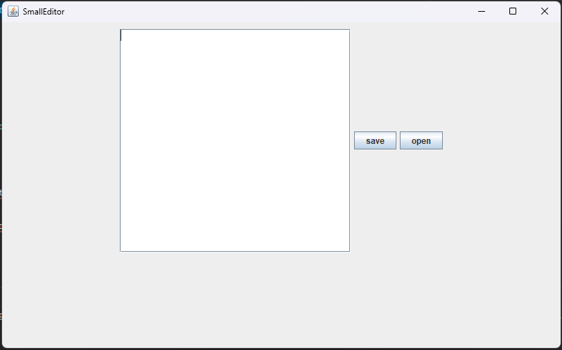

# Windows Text view.Editor 만들기

Windows 기본 내장되어있는 **메모장** 프로그램을 `java.swing`을 사용하여 만든 기록입니다. 

## 개발 환경
- Language : Java 11
- Packages
  - `java.swing`
  - `java.awt`
  - `java.nio.files`

## 개발 과정

### 1. GUI 구성 요소 만들기

Panel, Button, TextArea를 이용하여 기초적인 GUI 환경을 만들었습니다.

```JAVA
import javax.swing.*;
import java.awt.*;
import java.awt.event.ActionEvent;
import java.awt.event.ActionListener;

public class EditorPanel extends JFrame{
    private JPanel editorPanel;
    private JTextArea editorTextArea;
    private JScrollPane editorScroll;
    private JButton saveButton;
    private JButton openButton;

    public EditorPanel() {
        setDefaultCloseOperation(JFrame.EXIT_ON_CLOSE);
        setTitle("SmallEditor");
        setSize(350, 250);
        this.setLayout(new FlowLayout());

        // textEditor
        editorPanel = new JPanel();
        editorTextArea = new JTextArea(20, 30);
        editorScroll = new JScrollPane(editorTextArea);

        // Save Button 생성
        saveButton = new JButton("save");
        saveButton.addActionListener(new PushAction());

        // Open Button 생성
        openButton = new JButton("open");
        openButton.addActionListener(new PushAction());

        editorPanel.add(editorScroll);
        editorPanel.add(saveButton);

        this.add(editorPanel);
        this.setVisible(true);
    }

    public static void main(String[] args) {
        view.EditorPanel e = new view.EditorPanel();
    }
}
```



### 2. 저장 기능 구현

이제 저 save 버튼에 저장 기능을 구현해줍시다.

처음에는 간단하게 `FileOutputStream` 패키지를 활용하여 구현하였습니다. 파일 불러오니 다른 좋은 기능들은 일단 제껴놓고 저장만 시켜보죠

```JAVA
  public class PushAction implements ActionListener {
    @Override
    public void actionPerformed(ActionEvent e) {
        if(e.getSource() == saveButton) {
            try {
                Path path = Paths.get("C:\\Users\\SW2148\\project\\DiDLE\\src\\out\\test.txt");
                Files.write(path, editorTextArea.getText().getBytes());
            } catch (Exception error) {
                error.printStackTrace();
            }
        }
    }
}
```

smallTextEditor 클래스 안에 추가로 구현시켰습니다. SaveAction 버튼에 ActionPerformed 이벤트를 달아주어 클릭 시 해당 경로에 저장을 해줄 수 있도록 간단한 코드를 작성하였습니다. ~~FileOutputStream은 데이터를 추가할 시 어느 데이터든 byte로 컨버트하여 작성해야 하기에 TextArea 텍스트 데이터를 가져온 뒤 byte화 시키어 저장시켜주었습니다.~~

원래는 FileOutputStream을 쓰려고 했는데, Files 패키지 하나만으로 function.File I/O를 전부 잡아줄 수 있어서, 코드를 Files로 옮겼습니다. 역시 TextArea 텍스트들을 불러온 뒤 byte화 시키어 저장시키는 기능을 만들었습니다.

### 3. 파일 열기

기존에 있던 파일을 열어 수정해줄 수 있는 기능이 필요하겠죠? 이 기능을 위해 파일을 여는 기능을 버튼과 Action을 추가합니다.

```java
public class PushAction implements ActionListener {
        @Override
        public void actionPerformed(ActionEvent e) {
            if(e.getSource() == saveButton) {
                try {
                    Path path = Paths.get("C:\\Users\\SW2148\\project\\DiDLE\\src\\out\\test.txt");
                    Files.write(path, editorTextArea.getText().getBytes());
                } catch (Exception error) {
                    error.printStackTrace();
                }
            }
            // 이 부분 추가!
            else if(e.getSource() == openButton) {
                try {
                    String str = Files.readString(Paths.get("C:\\Users\\SW2148\\project\\DiDLE\\src\\out\\test.txt"));
                    editorTextArea.setText(str);
                } catch (IOException error) {
                    error.printStackTrace();
                }
            }
        }
    }
```

### 4. 메뉴바 구성

거진 모든 GUI 프로그램은 **메뉴바**가 존재합니다. 다양한 기능들을 함축적으로 모아 표현하기에 용이하기 때문이죠. Windows Notepad도 구현되어 있는데, 이 메모장 내에서도 구현시켜보겠습니다.

#### 모듈화 프로그래밍

그런데 한 파일에서만 작업하려고 하니, 코드 규모가 너무 커지고 기능 구현도 너무 방대해진 것 같았습니다. 이에 여러 기능들을 세부적으로 쪼개어 파일을 분리시키는 **모듈화 프로그래밍**의 필요성이 많이 느껴졌었습니다. 이에 트리 구조를 아래와 잡고 MenuBar를 추가함과 동시에 코드를 분리시켰습니다.

- Notepad
  - view.Editor : JFrame
  - view.EditorBar : 에디터 메뉴바
  - view.EditorPanel : 에디터 패널

```java
// view.Editor
package view;

import javax.swing.*;

public class Editor extends JFrame {
  private EditorPanel ep = new EditorPanel();
  private EditorBar eb = new EditorBar();

  public Editor() {
    setDefaultCloseOperation(JFrame.EXIT_ON_CLOSE);
    setTitle("SmallEditor");
    setSize(500, 500);

    setJMenuBar(eb);
    this.add(ep);
    this.setVisible(true);
  }
}
}
```

```java
// view.EditorBar
package view;

import javax.swing.*;
import java.awt.event.ActionEvent;
import java.awt.event.KeyEvent;

public class EditorBar extends JMenuBar {
  private JMenu fileMenu, editMenu, viewMenu;
  private JMenuItem openMenuItem, saveMenuItem;
  private ButtonGroup group = new ButtonGroup();

  EditorBar() {
    // Initialize function.File Menu
    fileMenu = new JMenu("File");
    fileMenu.setMnemonic(KeyEvent.VK_I);    // 단축기 설정
    this.add(fileMenu);

    // Create function.File Menu Field
    openMenuItem = new JMenuItem("Open");
    openMenuItem.setAccelerator(KeyStroke.getKeyStroke(KeyEvent.VK_O, ActionEvent.CTRL_MASK));
    // TODO: event add
    fileMenu.add(openMenuItem);

    saveMenuItem = new JMenuItem("Save");
    saveMenuItem.setAccelerator(KeyStroke.getKeyStroke(KeyEvent.VK_S, ActionEvent.CTRL_MASK));
    // TODO: event add
    fileMenu.add(saveMenuItem);

    setVisible(true);
  }
}

```

### 5. Function/View 분리
실제 기능을 담당하는 Function 부분과 GUI 화면을 출력하는 view 디렉터리로 분류했습니다. 그리고 `EditorPanel.java`에 포함되어있는 File I/O 기능을 옮기는 작업을 진행했습니다.

```JAVA
// open.java
package function.File;

import java.io.IOException;
import java.nio.file.Files;
import java.nio.file.Paths;
public class Open {
  public static String open() {
    String str = "";
    try {
      str = Files.readString(Paths.get("C:\\Users\\SW2148\\project\\DiDLE\\src\\out\\test.txt"));
    } catch (IOException error) {
      error.printStackTrace();
    }
    return str;
  }

}
```

```java
// save.java
package function.File;

import java.nio.file.Files;
import java.nio.file.Path;
import java.nio.file.Paths;
public class Save {
    public static void save(String text) {
        try {
            Path path = Paths.get("C:\\Users\\SW2148\\project\\DiDLE\\src\\out\\test.txt");
            Files.write(path, text.getBytes());
        } catch(Exception error) {
            error.printStackTrace();
        }
    }
}
```

Instance를 생성할 필요성을 못느껴서 그냥 정적 변수만을 사용해 구현하였습니다.

## 6. EditorPanel 삭제

텍스트 패널을 프레임 전체로 확장해서 사용하게끔 해야하는데, Panel을 분리하니 아무리 해도 Frame 크기 전체를 상속받지 못해 결국 Panel을 지우고 Editor에 추가 코드를 넣었습니다

## 7. Edit MenuBar 생성
swing에 기본 내장되어 있는 `copy()`, `paste()`, `cut()` 함수를 이용하여 편집칸을 제작하였습니다. Funtion에다 따로 기능을 분류하진 않았습니다.   
또한 Editor의 TextArea를 public으로 두어 접근 가능하도록 두었습니다.